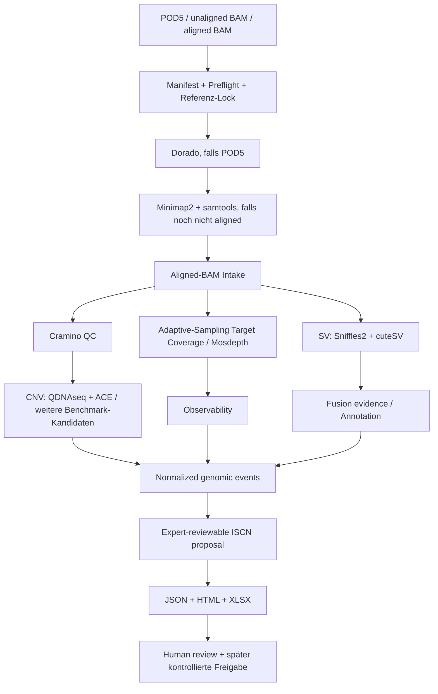

# ONTSeq Platform

ONTSeq **0.7.1** vereint Genomanalyse und optionale Methylierungsanalyse in einem lokalen
Arbeitsablauf. Methylierungsinformationen im BAM werden vor dem Start geprüft; ihre
Auswertung wird ausdrücklich ausgewählt. Der aktuelle Stand ist ein Integrationskandidat.

> **Research Use Only (RUO) — nicht klinisch validiert.**
>
> Dieses Repository entwickelt eine reproduzierbare, weitgehend automatisierte Auswertung von
> Oxford-Nanopore-Sequenzierungsdaten für die zytogenomische Analyse hämatologischer Proben.
> Ziel ist ein technisch nachvollziehbarer Weg von einer einzelnen Sequenzierungsprobe zu
> strukturierten, überprüfbaren Ergebnissen für **QC, Copy Number Variants (CNV), strukturelle
> Varianten (SV), später Fusionen und einen expert-reviewbaren ISCN-Vorschlag**. Die Software
> erzeugt Evidenz und Reports; sie gibt keinen klinischen Befund automatisch frei.

## 1. Was mit dem Projekt erreicht werden soll

Die praktische Zielvorstellung ist einfach:

1. Eine einzelne ONT-Probe wird ausgewählt.
2. Die Software prüft, ob Eingabedatei, Index und Referenz wirklich zusammenpassen.
3. Die technisch geeigneten Analyseschritte laufen reproduzierbar und protokolliert ab.
4. CNV- und SV-Evidenz wird in ein gemeinsames Ergebnisformat normalisiert.
5. Adaptive-Sampling-Zielregionen werden separat berücksichtigt, weil dort andere
   Coverage-Annahmen gelten als im restlichen Genom.
6. Die Ergebnisse werden als **JSON, selbstständiger HTML-Report und Excel-Arbeitsmappe**
   ausgegeben.
7. Der aktuelle Engineering-Pfad kann daraus begrenzte, ereignisbezogene CNV-Fragmente als
   ausdrücklich unvalidierten ISCN-Vorschlag erzeugen. Ein vollständiger ISCN-Karyotyp und ein
   klinischer Freigabeprozess sind weiterhin nicht implementiert.

Das Projekt soll also nicht nur einzelne Bioinformatikprogramme starten. Es soll einen
**nachvollziehbaren Analyseprozess** bauen: definierte Inputs, definierte Referenzen,
versionierte Parameter, reproduzierbare Tool-Aufrufe, explizite Fehlerzustände, einheitliche
Ergebnisobjekte, auditierbare Reports und später analytische Validierung.

## 2. Fachlicher Hintergrund

Der Ausgangspunkt ist die Idee, Oxford Nanopore Sequencing für eine schnelle genomweite
Karyotypisierung bzw. zytogenomische Charakterisierung zu nutzen. Besonders relevant sind
zwei Datentypen:

- **Low-coverage / shallow whole-genome sequencing (lcWGS/sWGS):** relativ geringe
  genomweite Coverage, aber genügend Information für große Copy-Number-Veränderungen.
- **Adaptive Sampling:** ausgewählte Genregionen werden während der Sequenzierung angereichert,
  um strukturelle Varianten bzw. Fusionskandidaten in diesen Regionen besser beobachten zu
  können, während gleichzeitig ein niedrigerer genomweiter Hintergrund bestehen kann.

Historischer Ausgangspunkt war eine frühere ONTseq-Pipeline und die 2026 abgeschlossene
Masterarbeit von Lea Evers. Dort wurden unter anderem Cramino, QDNAseq + ACE, Spectre,
Sniffles2/CuteSV/NanoSV, Annotation, ISCN-Logik und HTML-Reporting untersucht. Dieses
Repository ist jedoch **keine Kopie dieser Pipeline**. Die neue Implementierung ist bewusst
unabhängig aufgebaut: frühere Ergebnisse dienen als Vergleich und historische Evidenz, nicht
als automatische Quelle für aktuelle Algorithmen, Grenzwerte oder klinische Regeln.

Siehe dazu:

- [`docs/THESIS_TRACEABILITY.md`](docs/THESIS_TRACEABILITY.md)
- [`docs/EVIDENCE_BASE.md`](docs/EVIDENCE_BASE.md)
- [`docs/DECISIONS.md`](docs/DECISIONS.md)

## 3. Grundprinzipien der neuen Plattform

### Eine Probe = ein reproduzierbarer Run

Jede Analyse bekommt einen eigenen Run-Ordner mit Manifest, Referenzinformationen,
Zwischenergebnissen, normalisierten Resultaten, Reports, Provenienz und Prüfsummen.

### Evidence first, interpretation second

Ein Caller darf eine Variante finden; daraus wird nicht automatisch eine klinische Aussage.
Caller-Ausgaben werden zunächst als strukturierte Evidenz normalisiert. Klinische Einordnung,
ISCN und Freigabe liegen downstream und müssen separat geprüft werden.

### Fail closed

Die Plattform soll bei Unsicherheit nicht still weiterrechnen. Beispiele:

- BAM und BAI passen nicht zusammen → Abbruch.
- BAM-Header passt nicht zur gelockten Referenz → Abbruch.
- Adaptive Sampling wurde gewählt, aber die kontrollierte ROI-BED fehlt → kein stiller
  Rückfall auf WGS-Semantik.
- Ein Modul lief nicht → `NOT_RUN`, nicht "negativ".
- Ein Caller lief, konnte aber keinen belastbaren Call abgeben → `NO_CALL`, nicht "kein
  Befund".

### Keine Rohdaten in GitHub

POD5, FASTQ, BAM/CRAM, patientenbezogene VCFs, klinische Reports und direkte Identifikatoren
gehören nicht in dieses Repository. Reale Laufdaten bleiben auf kontrollierter lokaler bzw.
institutioneller Infrastruktur.

## 4. Aktueller technischer Stand auf `main`

Der aktuelle Stand ist bereits deutlich mehr als ein Konzept, aber noch keine fertige
Diagnostiksoftware.

| Bereich | Aktueller Stand |
| --- | --- |
| Single-sample Run-Envelope | Implementiert, mit atomaren Writes, Provenienz, Prüfsummen und content-basiertem Resume |
| Preflight / Intake | Implementiert; BAM/BAI, Sortierung, Referenz-Dictionary und weitere technische Voraussetzungen werden fail-closed geprüft |
| Aligned BAM | Der derzeit wichtigste reale Eingangspfad |
| Unaligned BAM | Alignment mit Minimap2 + samtools implementiert und mit realen Tools auf synthetischen Fixtures getestet |
| POD5 | Dorado-Adapter vorhanden, aber noch nicht gegen einen realen Dorado/GPU/Modell-Stack end-to-end verifiziert |
| QC | Cramino integriert |
| Adaptive-Sampling-Zielabdeckung | Mosdepth-Adapter ist als Stage im kanonischen Runner verdrahtet und läuft im End-to-End-CI; ein Adaptive-Sampling-Lauf ohne Policy bricht fail-closed ab |
| Zielpanel | Build-getrennte Adaptive-Sampling-Bundles: GRCh38 mit 111 Laborintervallen; GRCh37/hg19 mit 110/111 kontrolliert kartierten Auswahlintervallen und 108 nativen GENCODE-19-ROIs. Offene Ziele bleiben explizit review-pflichtig, siehe [`docs/PANEL_PROVENANCE.md`](docs/PANEL_PROVENANCE.md) |
| Komponentenauswahl | Provider und exakte Tool-Version je Stage pro Lauf wählbar, fail-closed gegen die installierte Version geprüft und in der Provenienz protokolliert |
| CNV | Live QDNAseq + ACE Multi-Resolution-Lane implementiert und in den kanonischen Runner einhängbar |
| SV | Sniffles2 2.8.0 + cuteSV 2.1.3, Breakpoint-Konsens, build-gelockte Annotation, Adaptive-Sampling-Observability, AML-Priorisierung und filterbare Review Queue; weiterhin nicht reportable |
| Methylierung | modkit-Pileup-Lane als Stage im kanonischen Runner; MM/ML-Tags werden fail-closed geprüft, ein leerer Pileup wird nie als "unmethyliert" berichtet. Lokaler synthetischer Pipeline-Smoke mit realem modkit 0.4.1 bestanden; noch keine reale modkit-CI-Prüfung oder biologische Validierung, siehe [`docs/METHYLATION_LANE.md`](docs/METHYLATION_LANE.md) |
| Methylierungs-Mischung | Standalone Nanopolish-Pfad für deterministische Mischungen zweier ausdrücklich als biologisch getrennt deklarierter Quellen; M/U-Call-Rate-WLS und ein bedingtes Vier-Zustands-Dirichlet-Intervall schätzen einen Source-A-Mischkoeffizienten gegenüber dem bekannten Readgruppenanteil oder liefern `NO_CALL`. Die Kalibrationsraten bleiben im Intervall fest. Eine getrennte technische Recovery-Bewertung verhindert, dass bloße Ausführbarkeit als Genauigkeit gilt. Sensibler technischer Output, keine Tumor-, Zell- oder DNA-Massenfraktion und keine LoD, siehe [`docs/METHYLATION_MIXTURE.md`](docs/METHYLATION_MIXTURE.md) |
| Verdünnungsreihe / LoD | Deterministische In-silico-Tumorverdünnung (Planung, Mischung, Drift-Prüfung) und technische Detektionsgrenze mit explizitem Bracketing, siehe [`docs/DILUTION_SERIES.md`](docs/DILUTION_SERIES.md); keine analytische Sensitivität |
| Fusionen | Forschungs-/Entwicklungsarbeit vorhanden, aber noch nicht als klinisch interpretierender Standardpfad auf `main` freigegeben |
| ISCN | Strukturierter Vorschlagspfad im Result-Schema `0.3.0`: CNV-only Ereignisfragmente, explizite Zustände/Blocker und checksum-gebundene GRCh37-/GRCh38-Provenienz; keine vollständige Karyotypisierung oder klinische Freigabe |
| Output | Validiertes JSON, HTML, XLSX und checksummed release bundle |
| Windows Desktop | WPF-Oberfläche vorhanden; Linux/R-Bioinformatik läuft im gebündelten WSL2-Runtime-Backend |

### CNV-Lane im aktuellen Engineering-Stand

Die aktuelle QDNAseq/ACE-Lane arbeitet mit mehreren Auflösungen:

- 100 kbp
- 500 kbp
- 1000 kbp

Die aktuelle technische Policy verwendet 500 kbp als primäre Ansicht und behält Ergebnisse
aller Auflösungen für den Vergleich bzw. einen Chromosomen-Konsensus. ACE wird zur
automatischen Schätzung von Cellularity/Purity und Ploidy verwendet. Der derzeit konfigurierte
ACE-Penalty-Wert von `0.6` ist ein **Engineering-/Benchmark-Ausgangspunkt**, kein universeller
klinischer Grenzwert.

Im installierten System-Selbsttest wird zusätzlich geprüft, ob eine deterministische
synthetische CNV-Konstellation über die drei Auflösungen reproduzierbar wiedergefunden wird.
Das beweist, dass die Softwarekette technisch reproduzierbar läuft; es beweist nicht die
analytische Sensitivität oder Spezifität an realen Proben.

Der Desktop bündelt getrennte, gelockte QDNAseq-Annotationspakete für **GRCh37/hg19** und
**GRCh38**. Beide Build-Lanes werden mit echten QDNAseq-/ACE-Werkzeugen geprüft; die
GRCh38-Ressource ist zusätzlich auf den festgeschriebenen Upstream-Commit gebunden. Das gewählte
Analyseprofil bestimmt ausschließlich die buildpassende Annotation, ohne Fallback oder Liftover.

### ISCN-Vorschlag im aktuellen Engineering-Stand

ONTSeq `0.7.1` schreibt den strukturierten Result-Vertrag `0.3.0`. Darin unterscheidet der
ISCN-Vorschlag zwischen `NOT_REQUESTED`, `NOT_ASSESSED`, `NO_RENDERABLE_CANDIDATE` und
`PARTIAL_EVENT_LEVEL`; ältere Result-Verträge bleiben als `LEGACY_UNSPECIFIED` erkennbar. Jeder
berücksichtigte Event erhält eine nachvollziehbare Disposition, auch wenn er wegen Policy oder
nicht unterstützter Semantik nicht gerendert wird.

Der reguläre Vorschlagspfad erzeugt ausschließlich unterstützte Ereignisfragmente aus dem
typisierten CNV-Report. Dafür müssen Genome Build, Referenz-Lock, Cytoband-Ressource und
Annotationscache für GRCh37 oder GRCh38 per Prüfsumme zusammenpassen. Fehlende Ressourcen,
fehlende geeignete CNV-Evidenz oder fehlgeschlagene QC führen fail-closed zu `NOT_ASSESSED`.
SV/BND, Translokationen und Inversionen werden derzeit nicht automatisch in ISCN umgewandelt.
`+chr`/`-chr` wird zusätzlich nur vorgeschlagen, wenn der CNV-Abschnitt exakt vom Anfang bis zum
Ende des gelockten Referenzkontigs reicht; eine bloße Ganzchromosomen-Klassifikation über den
90%-Schwellenwert genügt dafür nicht.

Der Vorschlag enthält bewusst keinen erfundenen Basiskaryotyp. Chromosomenzahl,
Geschlechtschromosomen-Komplement, Klonalität, Phase, Derivativstruktur, Balance und Normalität
werden nicht inferiert. `NO_RENDERABLE_CANDIDATE` ist deshalb kein Normalbefund. Jeder Vorschlag
bleibt fachlich zu prüfen und kann nicht automatisch klinisch freigegeben werden; dies ist keine
Behauptung vollständiger ISCN-2024-Konformität.

### SV-Lane

Sniffles2 und cuteSV erzeugen unabhängige strukturelle Varianten als Kandidaten-Evidenz. Die
SV-Lane:

- verwendet explizite Tool-Versionen und Parameter;
- schreibt zunächst in Staging-Dateien und fördert ein VCF erst nach erfolgreicher Prüfung;
- normalisiert DEL/DUP/INV/INS/BND in das gemeinsame Ereignismodell;
- exportiert keine Read-Namen oder Insert-Sequenzen in Reviewer-Artefakte;
- vereinigt kompatible Breakpoints, ohne Caller-Konsens als Ground Truth zu behandeln;
- annotiert beide Breakpoints aus build- und checksum-gelockten Gen-/Cytoband-Ressourcen;
- ergänzt Repeat-/Blacklist-/Mappability-Kontext und Adaptive-Sampling-Observability;
- priorisiert bekannte AML-Rearrangement-Muster, bestätigt aber keine Fusion;
- zeigt eine kompakte filterbare Review Queue und darunter alle technischen Calls;
- behandelt `NO_CALL` ausdrücklich nicht als biologisch negatives Ergebnis.

Ein BND/TRA ist in dieser Architektur **noch keine bestätigte Fusion**. Fusionen benötigen
zusätzliche Breakpoint-, Gen-, Orientierungs-, Observability- und ggf. orthogonale
Bestätigungsevidenz.

## 5. Die geplante Gesamtarchitektur



Nicht jeder Block ist heute vollständig implementiert. Das Diagramm beschreibt die Zielarchitektur.
Der aktuelle Code soll fehlende Module sichtbar als fehlend behandeln und nicht vortäuschen,
dass sie bereits validiert vorhanden wären.

## 6. Zwei Assay-Modi müssen getrennt gedacht werden

### lcWGS

Der genomweite read-depth-Hintergrund ist die Grundlage für die CNV-Analyse. Zentrale offene
Validierungsfragen sind unter anderem:

- erreichbare durchschnittliche Coverage;
- GC- und Mappability-Effekte;
- minimale nachweisbare Ereignisgröße;
- Einfluss von Tumor-/Blastenanteil;
- Ploidy/Cellularity-Schätzung;
- Robustheit verschiedener Bin-Größen;
- Reproduzierbarkeit und No-Call-Verhalten.

### Adaptive Sampling

Adaptive Sampling ist **nicht einfach lcWGS mit mehr Coverage**. On-target- und off-target
Reads können unterschiedliche statistische Eigenschaften haben. Deshalb müssen getrennt
beurteilt werden:

- tatsächliche Coverage in der kontrollierten ROI-BED;
- Gleichmäßigkeit der Zielanreicherung;
- Observability beider Breakpoints;
- Eignung des off-target-Anteils für genomweite CNV-Inferenz;
- Verhalten bei niedriger oder asymmetrischer Target-Coverage;
- welche Negativaussage überhaupt zulässig ist, wenn ein Zielbereich unzureichend beobachtet
  wurde.

Die Plattform führt diese Unterschiede absichtlich als Assay-/Datenbasis mit und versteckt
sie nicht in Caller-Parametern.

## 7. Was die Reports bedeuten

Die wichtigsten Ausgabeformen sind:

- `result.json` — maschinenlesbares, versioniertes Ergebnisobjekt;
- `report.html` — selbstständiger Reviewer-Report;
- `results.xlsx` — tabellarische Prüfung, inklusive CNV-Fits/Konsensus, sofern vorhanden;
- `release.json` und `checksums.sha256` — technische Nachvollziehbarkeit des erzeugten
  Run-Bundles.

Ein technisches `PASS` bedeutet: **die geforderten Softwarestufen liefen gemäß ihren
technischen Verträgen**. Es bedeutet nicht, dass die Probe biologisch unauffällig ist oder
alle relevanten Aberrationen sicher ausgeschlossen wurden.

## 8. Windows-Desktop

Für die spätere Routinebedienung gibt es eine Windows-native WPF-Oberfläche. Die Oberfläche
enthält keine eigene Bioinformatik. Sie startet den gebündelten Linux/R-Stack über WSL2 und
spricht mit demselben lokalen Backend, das auch die CLI verwendet.

Typischer Ablauf:

1. gesamten Engineering-ZIP entpacken;
2. `ONTSeq.Desktop.exe` starten;
3. unter **System einrichten** den gebündelten Runtime installieren;
4. die **exakte** Referenz konfigurieren, die zur BAM-Ausrichtung verwendet wurde;
5. bei Adaptive Sampling das exakt passende build- und dictionary-gebundene Profil wählen; die
   kontrollierte Auswahl- und Analyse-ROI werden aus dessen manifestiertem Panel aufgelöst;
6. den vollständigen synthetischen **Selbsttest** ausführen;
7. eine aligned BAM und den zugehörigen Index auswählen;
8. Genome Build und Assay-Modus auswählen;
9. **ANALYSE STARTEN**;
10. HTML/XLSX/Ergebnisordner über die Oberfläche öffnen.

Details: [`desktop/README.md`](desktop/README.md)

## 9. CLI: schneller Einstieg

Entwicklungsinstallation:

```bash
python -m pip install -e ".[dev,workflow]"
```

Kleine synthetische Demo ohne reale Genomdaten:

```bash
ontseq demo --output-dir results/demo
```

Real-Tool-Smoke mit synthetischen Alignments:

```bash
micromamba create -f workflow/envs/aligned_bam.yaml
micromamba run -n ontseq-aligned-bam env PYTHONPATH=src \
  python -m ontseq_platform local-smoke --output-dir results/local-smoke
```

Vollständiger installierter Engineering-Systemtest inklusive QDNAseq/ACE-CNV:

```bash
ontseq system-smoke --output-dir results/system-smoke
```

Kanonischer Run:

```bash
ontseq run sample.manifest.json \
  --reference-lock /approved/references/reference.lock.json \
  --reference-fasta /approved/references/reference.fasta \
  --run-id RUN_001
```

Direkter JSON-Run-Bericht für Automation und Monitoring:

```bash
ontseq run sample.manifest.json \
  --reference-lock /approved/references/reference.lock.json \
  --reference-fasta /approved/references/reference.fasta \
  --run-id RUN_001 \
  --json --json-output results/run.json
```

Um die lokale Umgebung vor dem ersten produktiven Einsatz zu prüfen:

```bash
ontseq doctor
ontseq doctor --strict --output-dir results/doctor
```

Kurzbefehle für den lokalen Test (PowerShell):

```powershell
# Einmalig in der aktuellen Session:
$env:PYTHONPATH = "$PWD\src"

function ontseq-demo {
    python -m ontseq_platform.entrypoint demo --output-dir results\demo
}

function ontseq-doctor {
    param([switch]$Strict)
    if ($Strict) {
        python -m ontseq_platform.entrypoint doctor --strict --output-dir results\doctor
    } else {
        python -m ontseq_platform.entrypoint doctor --output-dir results\doctor
    }
}
```

Batch-freundliche Aufrufvariante:

```batch
@echo off
set "PYTHONPATH=%~dp0..\src"
python -m ontseq_platform.entrypoint doctor --strict --output-dir results\doctor
python -m ontseq_platform.entrypoint demo --output-dir results\demo
```

CI-geeignete Testzusammenfassung mit JSON-Ausgabe:

```powershell
pwsh .\scripts\run_test_suite.ps1 -JsonSummary
pwsh .\scripts\run_test_suite.ps1 -JsonSummary -SummaryPath .\artifacts\run_suite_summary.json
```

Komponenten für genau diesen Lauf wählen — etwa Sniffles 2.4 statt 2.8.0 für einen
Vergleich, oder die CNV-Lane abschalten:

```bash
ontseq run sample.manifest.json \
  --reference-lock /approved/references/reference.lock.json \
  --run-id RUN_001 \
  --components configs/components/legacy_sniffles_2.4.yaml

ontseq run sample.manifest.json ... --without cnv
```

Die gewählte Version wird vor dem Lauf gegen die tatsächlich installierte geprüft. Stimmt
sie nicht, bricht die betroffene Stage ab und nennt beide Versionen. Details in
[`docs/COMPONENT_SELECTION.md`](docs/COMPONENT_SELECTION.md).

Vor einem realen Run sollte immer zuerst die dokumentierte Preflight-/Reference-Lock-Logik
verwendet werden. Für echte genomische Daten gelten die lokalen Daten- und Governance-Regeln.

Technischer Paired-Source-Methylierungstest aus zwei extern gespeicherten Nanopolish-Tabellen:

```bash
ontseq methylation-mixture \
  --source-a-calls source_a.tsv.gz --source-b-calls source_b.tsv.gz \
  --source-a-id SOURCE_A --source-b-id SOURCE_B \
  --confirm-biologically-distinct-sources \
  --source-a-metadata source_a.metadata.yaml \
  --source-b-metadata source_b.metadata.yaml \
  --source-a-genome-build GRCh38 --source-b-genome-build GRCh38 \
  --analysis-id METH_MIX_001 \
  --policy configs/methylation/paired_source_nanopolish.technical.yaml \
  --output-dir results/methylation-mixture/METH_MIX_001
```

Der geschätzte Wert ist ein methylierungsbasierter Source-A-Mischkoeffizient. Seine bekannte
Vergleichsgröße im Experiment ist der Anteil gehaltener Readgruppen aus Quelle A. Ohne zusätzliche
biologische Kalibrierung ist er kein Tumor-, Zell- oder DNA-Massenanteil. JSON, CSV und HTML sind
sensible abgeleitete Genomdaten. Ein kleiner öffentlicher Smoke-Test belegt nur die technische
Ausführbarkeit, weder Purity/LoD noch das Speicherverhalten großer Ganzgenom-Tabellen. Optionale
Source-Metadaten werden strukturiert übernommen; fehlende Provenienz bleibt explizit `unknown`
und erzeugt Warnungen. `COMPLETED` beschreibt die Quantifizierbarkeit des Grids; die separate
Recovery-Bewertung prüft Bias, MAE, RMSE und Intervallabdeckung gegen bekannte Mischanteile.

### Sofortiger Windows-Test (ein Klick-Nähe)

Für einen kompletten lokalen Starttest ist ein praktisches Skript im Repo verfügbar:

```powershell
.\scripts\run_test_suite.ps1
```

Das Skript führt aus:

- Installation (`python -m pip install -e ".[dev,workflow]"`)
- Safety-/Version-/Lint-/Type-/Test-Checks (`make`-Äquivalente mit Module-Calls)
- Einen vollständig synthetischen End-to-End-Scheinlauf mit `ontseq demo`

Nützliche Varianten:

```powershell
.\scripts\run_test_suite.ps1 -NoInstall
.\scripts\run_test_suite.ps1 -SkipChecks
```

Nach dem Lauf findest du die Artefakte in `results\quick-test\`:

- `demo/` → JSON/HTML/XLSX aus einem rein synthetischen Referenzszenario

Hinweis: Der optionale `system-smoke` ist im Skript bewusst als manuell dokumentierter
Erweiterungsschritt erwähnt, da er die komplette, externe Tool-Installation voraussetzt.
## GRCh38-/GRCh37-Profile und automatische Ressourcen

Der neue Profilpfad benötigt neben dem indizierten BAM keine manuelle Auswahl von FASTA,
Cytobands, GENCODE, MANE, Panel oder Knowledge-Dateien:

```bash
ontseq references install GRCh38_GENCODE50_MANE1.5_v1
ontseq references status
ontseq analyze SAMPLE_GRCH38.bam --profile AML_LCWGS_GRCh38
ontseq analyze SAMPLE_GRCH38.bam --profile AML_AS_111_GRCh38
ontseq analyze SAMPLE_GRCH38_CANONICAL25.bam --profile AML_LCWGS_GRCh38_CANONICAL25
ontseq analyze SAMPLE_GRCH38_CANONICAL25.bam --profile AML_AS_111_GRCh38_CANONICAL25
```

`AML_LCWGS_GRCh38` und `AML_AS_111_GRCh38` behalten den bestehenden `exact_full`-Vertrag:
Das BAM-Dictionary muss dem vollständigen, geordneten Primary-Assembly-`ReferenceLock`
entsprechen. Die beiden expliziten `*_CANONICAL25`-Profile verlangen dagegen exakt
`chr1`-`chr22`, `chrX`, `chrY`, `chrM` in dieser Reihenfolge und mit den GRCh38-Standardlängen.
Alle vier Profile verwenden dieselben installierten GRCh38-Referenz-, Annotations-, Panel- und
Knowledge-Bundles. Die Auswahl eines Canonical-25-Profils führt daher weder zu einem erneuten
Mehr-GiB-Download noch zu Liftover oder stillem Fallback. GRCh37-, partielle, gemischte oder zu
keinem Profil passende Dictionaries werden vor Pipelinebeginn abgelehnt. Das vollständige
Installations-, Offline- und Updateverfahren steht in
[`docs/REFERENCE_SYSTEM.md`](docs/REFERENCE_SYSTEM.md).

GRCh37 bietet entsprechend vier getrennte Profile: `AML_LCWGS_GRCh37` und
`AML_AS_111_GRCh37` für das vollständige GENCODE-19-Publisher-Dictionary sowie
`AML_LCWGS_GRCh37_UCSC_HG19_CANONICAL25` und
`AML_AS_111_GRCh37_UCSC_HG19_CANONICAL25` für exakt chr1–22/X/Y/M nach UCSC hg19. Die beiden
Adaptive-Sampling-Profile pinnen ausschließlich `AML_AS_111_GRCh37_v1`. Dessen Auswahl enthält
110 von 111 kontrolliert bei `minMatch=0.99` kartierte Laborintervalle; 109 sind im Rücktest
exakt und 108 Ziele erhalten eine native GENCODE-19-ROI. `ACACA` bleibt Roundtrip-Review,
`CT45A2`, `IGH` und `GPR128` bleiben als Mapping-/ROI-Lücken sichtbar review-pflichtig. Die
Koordinatenprojektion fand nur bei der Erstellung des unveränderlichen Bundles statt; im Lauf
gibt es kein Liftover, keine Referenzsubstitution und keinen Rückfall auf das GRCh38-Panel.

## 10. Repository-Struktur

| Pfad | Zweck |
| --- | --- |
| `src/ontseq_platform/` | Python-Core, Datenmodelle, Adapter, Runner, Reporting |
| `src/ontseq_platform/cnv/` | aktuelle QDNAseq/ACE-CNV-Lane |
| `workflow/` | Snakemake-/Umgebungsdefinitionen und reproduzierbare Tool-Runtimes |
| `desktop/` | Windows-WPF-Oberfläche und Desktop-Tests |
| `configs/` | versionierte technische Policies und Assay-Konfiguration |
| `schemas/` | JSON-Schemas für Manifeste und Resultate |
| `tests/` | Unit-, Contract-, Safety- und Regressionstests |
| `docs/` | Architektur, Evidenzbasis, Entscheidungen, Validierung und Roadmap |
| `.github/` | CI, Desktop-CI, Templates und Automatisierung |

## 11. Empfohlene Lesereihenfolge für neue Mitwirkende

Wer das Projekt technisch übernehmen oder beurteilen möchte, sollte in dieser Reihenfolge
lesen:

1. **diese README** — Zweck, aktueller Stand, Grenzen;
2. [`desktop/README.md`](desktop/README.md) — aktueller Nutzer-/Windows-Pfad;
3. [`docs/ARCHITECTURE.md`](docs/ARCHITECTURE.md) — Designprinzipien und Run-Envelope;
4. [`docs/PIPELINE_EXECUTION.md`](docs/PIPELINE_EXECUTION.md) — Runner, Resume, Preflight,
   Watchfolder und Ausführungslogik;
5. [`docs/EVIDENCE_BASE.md`](docs/EVIDENCE_BASE.md) — wissenschaftliche und technische
   Begründung der Tool-Auswahl;
6. [`docs/THESIS_TRACEABILITY.md`](docs/THESIS_TRACEABILITY.md) — was aus der historischen
   Pipeline übernommen, neu bewertet oder bewusst nicht übernommen wurde;
7. [`docs/CLINICAL_VALIDATION.md`](docs/CLINICAL_VALIDATION.md) — was vor diagnostischer
   Nutzung noch analytisch validiert werden müsste;
8. offene Pull Requests und Issues — dort liegt die aktuellste Entwicklungsarbeit.

Wenn Dokumentation und Code einen unterschiedlichen Entwicklungsstand zeigen, ist der
**ausführbare Code auf dem jeweiligen Commit plus CI-Evidenz** maßgeblich. Mehrere Dokumente
enthalten bewusst historische Milestone-Beschreibungen.

## 12. Die nächsten fachlich wichtigen Schritte

In der derzeitigen Priorisierung sollten neue Features nicht vor Robustheit und echter
Validierung kommen.

### Kurzfristig: realer End-to-End-Pfad

0. offene Panel-Frage klären: die mit `IGH` beschriftete Zeile liegt auf chr5, IGH liegt auf
   chr14q32. Solange das nicht entschieden ist, bleibt das Panel `derived_unconfirmed`.
   Parallel `fusion_panel_with_buffer.bed` aus dem historischen Repository anfordern und
   gegen die abgeleitete Datei prüfen;
1. genaue lokale GRCh37/GRCh38-Referenzdistribution identifizieren und locken;
2. reale, nicht in Git gespeicherte Forschungs-BAM gegen diese Referenz durch Preflight schicken;
3. Desktop → WSL → Backend → CNV/SV → HTML/XLSX auf dem Zielrechner vollständig durchlaufen;
4. Verhalten auf Netzlaufwerken des realen Arbeitsplatzes prüfen;
5. jedes technische Problem reproduzierbar als Testfall zurück in CI bringen.

### Danach: analytische CNV-Validierung

- QDNAseq/ACE gegen orthogonal charakterisierte Proben testen;
- Performance nach Coverage, Blasten-/Tumoranteil, Ereignisgröße und Genome Build stratifizieren;
- 100/500/1000-kbp-Lanes und Konsensusstrategie quantitativ vergleichen;
- Cellularity-/Ploidy-Schätzung separat validieren;
- Sensitivität, Spezifität, LoD, Präzision, Reproduzierbarkeit und No-Call-Verhalten vorab
  definieren und messen;
- Spectre bzw. weitere Kandidaten nur über denselben Benchmark-Rahmen vergleichen.

### Adaptive Sampling / Fusionen

- reale Analyse-ROI des Panels mit Version und SHA256 locken;
- On-target- und off-target-Coverage empirisch charakterisieren;
- Breakpoint-Observability definieren;
- Sniffles2/CuteSV bzw. weitere Caller mit geeigneter Truth/orthogonaler Bestätigung evaluieren;
- erst danach Genpaar-/Fusionsinterpretation und Reportability aufbauen.

### ISCN

Der aktuelle CNV-only Renderer ist ausdrücklich nur ein technischer Vorschlagspfad. ISCN darf erst
nach einer autorisierten ISCN-2024-Regelbasis, positiven/negativen Edge-Case-Tests, separat
validierten GRCh37-/GRCh38-Ressourcen, validierter komplexer Rearrangement-Semantik und fachlicher
Review als Konformitätsziel betrachtet werden.

## 13. Was nicht als erledigt gelten darf

Folgende Aussagen sind derzeit **nicht** durch dieses Repository belegt:

- "Die Pipeline ist klinisch validiert."
- "Ein technisches PASS bedeutet einen negativen Befund."
- "Ein Sniffles-BND ist automatisch eine Fusionsdiagnose."
- "Die aktuelle ACE-Penalty oder Bin-Größe ist universell optimal."
- "Adaptive-Sampling-off-target Reads sind bereits nachgewiesen gleichwertig zu lcWGS."
- "GRCh37- und GRCh38-Ergebnisse können ohne kontrollierte, build-spezifische Ressourcen
  einfach ineinander übersetzt werden."
- "Die limitierte ISCN-Proposal-Logik ist ISCN-2024-konform validiert."

## 14. Entwicklungsstatus

Python-Core und Desktop: `0.7.1` (lokaler Engineering-Kandidat vom 2026-09-09).
Dieser Arbeitsstand ist keine Behauptung über eine veröffentlichte GitHub-Version oder
klinische Freigabe. Änderungen und Validation impact stehen in [`CHANGELOG.md`](CHANGELOG.md).

Die vier bestehenden GRCh38-Profile behalten ihre getrennten Dictionary-Verträge.
`AML_LCWGS_GRCh37` verwendet einen eigenen GRCh37.p13-/GENCODE-19-Bundlevertrag mit
vollständigem Publisher-Dictionary. Für BAMs mit exakt `chr1`–`chr22`, `chrX`, `chrY` und
UCSC-hg19-`chrM=16571` steht getrennt `AML_LCWGS_GRCh37_UCSC_HG19_CANONICAL25` bereit.
Die entsprechenden Adaptive-Sampling-Profile `AML_AS_111_GRCh37` und
`AML_AS_111_GRCh37_UCSC_HG19_CANONICAL25` verwenden dasselbe jeweilige Dictionary, aber
zusätzlich ausschließlich das GRCh37-Panel `AML_AS_111_GRCh37_v1` (110/111 Auswahlintervalle,
109 reciprocal-exakt, 108 native Analyse-ROIs; ACACA-Roundtrip-Review plus drei explizite
Mapping-/ROI-Lücken).
Der Live-Workspace unter `/workspace` arbeitet mit dem
lokalen Backend; die eigenständige UX-Demo ist kein Ausführungsnachweis.
Es gibt kein Liftover, kein Reheadering, keine automatische Referenzsubstitution und keine Freigabe
wissenschaftlicher Schwellen. Umfang und Grenzen: [GRCh37-Integration](docs/GRCH37_INTEGRATION.md).

Dieses Repository hat derzeit **keine Open-Source-Lizenz**. Vor einer öffentlichen
Veröffentlichung oder diagnostischen Nutzung müssen institutionelle Governance, IP/Lizenzierung,
Datenschutz, Validierung und gegebenenfalls Medizinprodukterecht separat geklärt werden.

## 15. Wichtigste Dokumente

- [Architecture](docs/ARCHITECTURE.md)
- [Pipeline execution](docs/PIPELINE_EXECUTION.md)
- [Component selection](docs/COMPONENT_SELECTION.md)
- [Panel provenance](docs/PANEL_PROVENANCE.md)
- [Legacy comparison](docs/LEGACY_COMPARISON.md)
- [Evidence base](docs/EVIDENCE_BASE.md)
- [Aligned-BAM MVP](docs/ALIGNED_BAM_MVP.md)
- [Desktop](desktop/README.md)
- [Benchmarking](docs/BENCHMARKING.md)
- [Methylation lane](docs/METHYLATION_LANE.md)
- [Paired-source methylation mixtures](docs/METHYLATION_MIXTURE.md)
- [Prospective two-source methylation holdout](docs/METHYLATION_HOLDOUT.md)
- [Current methylation holdout status](docs/METHYLATION_HOLDOUT_STATUS.md)
- [Dorado MM/ML and modkit extract-full adapter](docs/MODBAM_ADAPTER.md)
- [Public methylation source candidates and intake proposal](docs/METHYLATION_ADDITIONAL_DATA_SEARCH.md)
- [Dilution series and detection limit](docs/DILUTION_SERIES.md)
- [Master-thesis traceability](docs/THESIS_TRACEABILITY.md)
- [Clinical validation plan](docs/CLINICAL_VALIDATION.md)
- [Roadmap](docs/ROADMAP.md)
- [Data security](docs/DATA_SECURITY.md)
- [Required inputs and literature](docs/REQUIRED_INPUTS_AND_LITERATURE.md)
