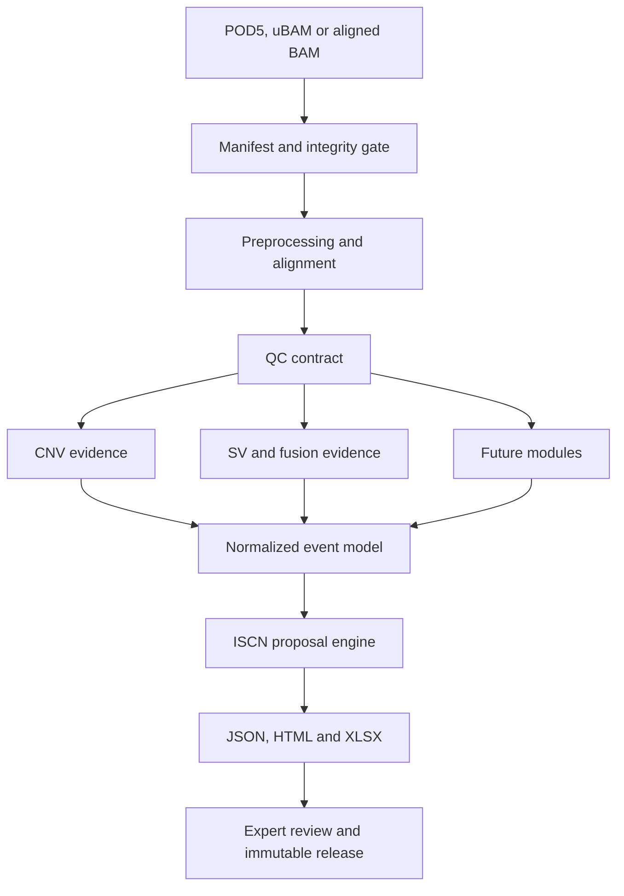

# Architecture

## Design principles

1. **One sample, one immutable run envelope.** Every run has a validated manifest,
   isolated working directory, result contract, logs, tool versions and checksums.
2. **Evidence before interpretation.** Callers emit normalized evidence. ISCN and clinical
   interpretation are downstream, reviewable views rather than hidden caller side effects.
3. **Assay modes stay separate.** Low-coverage WGS and adaptive sampling use different
   coverage assumptions, QC and reportability policies.
4. **Fail visibly.** A missing module is `NOT_RUN`; it is never represented as a negative
   biological result.
5. **No automatic clinical release.** Software can assemble a proposal, but an authorized
   reviewer owns interpretation and signature.
6. **Evidence-gated algorithms.** A tool is a candidate until it passes the locked benchmark
   for its assay, coverage, tumor/blast fraction and reportable event classes.

## Logical flow



## Run envelope

Created by `ontseq run`; see [Pipeline execution](PIPELINE_EXECUTION.md) for the rules that
govern it. Entries marked *planned* do not exist yet — everything else is written by a real
run today.

```text
<output-dir>/<run_id>/<sample_id>/
├── manifest/
│   ├── sample.manifest.json
│   ├── reference.lock.json
│   └── intake.json
├── qc/
│   └── cramino.json
├── evidence/
│   ├── cnv/                              (planned; no caller is wired in)
│   ├── sv/
│   │   ├── <sample>.sniffles.vcf         (never exportable)
│   │   └── <sample>.sniffles.json
│   └── fusion/                           (planned)
├── alignment/                            (never exportable)
│   ├── <sample>.unaligned.bam            (POD5 runs only)
│   ├── <sample>.bam
│   └── <sample>.bam.bai
├── normalized/
│   └── <sample>.result.json
├── reports/
│   ├── <sample>.report.html
│   └── <sample>.results.xlsx
├── provenance/
│   ├── run.json                          (stages, tool versions, artifact checksums)
│   ├── alignment.json                    (unaligned/POD5 runs only)
│   └── basecall.json                     (POD5 runs only)
├── release/
│   ├── release.json
│   ├── checksums.sha256
│   └── signed-release.json               (planned; bundles are currently unsigned)
└── work/                                 (scratch; never exportable)
```

Two directories carry a hard rule rather than a convention. `alignment/` and `work/` are
**never exportable**, and neither is any file with a raw genomic suffix wherever it sits;
`is_exportable()` enforces both, and the suffix list mirrors the one that keeps raw data out
of Git. A release bundle lists withheld artifacts by path but never contains them.

Tool versions and parameters live inside `provenance/run.json` per stage rather than in
separate `tools.json` and `parameters.json` files, so that a reader cannot end up holding a
parameter set without knowing which stage outcome it produced.

## Adapter boundary

Each bioinformatics tool will have an adapter with four responsibilities:

1. validate required input and reference compatibility;
2. build an auditable command without shell interpolation of untrusted values;
3. capture versions, parameters, exit status and raw output paths;
4. normalize output into the versioned event contract.

Adapters never decide clinical reportability on their own. Reportability policy belongs to
the versioned assay profile and its validation evidence.

The first scientific adapter implements this boundary for Sniffles2: shell-free argument-vector
execution, explicit version and thresholds, symbolic VCF output without read names, defensive VCF
normalization and non-reportable candidates. BND evidence remains an SV breakend; fusion and ISCN
semantics require separate downstream modules.

## Evidence lifecycle

Each scientific dependency progresses through `candidate -> benchmarked -> validated ->
retired`. Promotion requires a versioned evidence record, locked test data, predefined metrics
and validation-impact review. Literature supports candidate selection; it cannot replace local
analytical validation. See `docs/EVIDENCE_BASE.md`.

## ISCN boundary

The `subset-v0.1-unvalidated` renderer exists to exercise traceability and reporting. It is
not a substitute for the authorized ISCN 2024 standard. Full implementation requires:

- build-aware coordinate-to-cytoband reference locks;
- syntactic parser and renderer round trips;
- authorized positive, negative and edge-case test cases;
- clone/mosaicism and uncertainty semantics;
- expert cytogenetic review and controlled change management.
