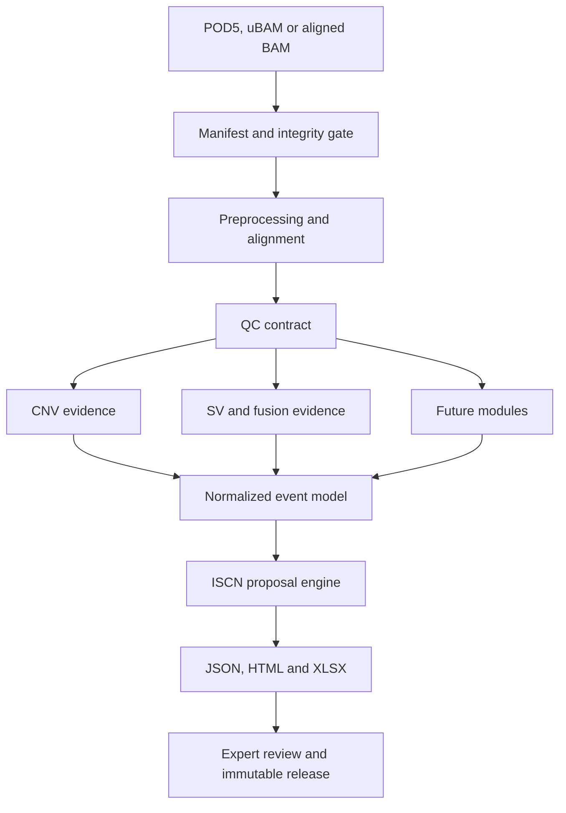

# Architecture

## Design principles

1. **One sample, one immutable run envelope.** Every run has a validated manifest,
   isolated working directory, result contract, logs, tool versions and checksums.
2. **Evidence before interpretation.** Callers emit normalized evidence. ISCN and clinical
   interpretation are downstream, reviewable views rather than hidden caller side effects.
3. **Assay modes stay separate.** Low-coverage WGS and adaptive sampling use different
   coverage assumptions, QC and reportability policies.
4. **Fail visibly.** A missing module is `NOT_RUN`; it is never represented as a negative
   biological result.
5. **No automatic clinical release.** Software can assemble a proposal, but an authorized
   reviewer owns interpretation and signature.
6. **Evidence-gated algorithms.** A tool is a candidate until it passes the locked benchmark
   for its assay, coverage, tumor/blast fraction and reportable event classes.

## Logical flow



## Planned run envelope

```text
results/<run_id>/<sample_id>/
├── manifest/
│   ├── sample.manifest.json
│   ├── input.checksums.sha256
│   └── reference.lock.json
├── qc/
│   ├── qc.contract.json
│   └── metrics/
├── evidence/
│   ├── cnv/
│   ├── sv/
│   └── fusion/
├── normalized/
│   └── result.json
├── reports/
│   ├── report.html
│   └── results.xlsx
├── provenance/
│   ├── tools.json
│   ├── parameters.json
│   └── workflow.dag.svg
└── release/
    ├── review.json
    ├── checksums.sha256
    └── signed-release.json
```

## Adapter boundary

### Unified 0.7 analysis selection

Desktop preparation verifies WSL, the backend and each input/output, resource and runtime
prerequisite separately. Local typed exceptions identify the failed component and path;
fixed check identifiers are transported independently of localized shell diagnostics.
An error before service preparation is displayed as a probe that has not started, and
does not become a BAM worker failure or a negative methylation observation. This local
presentation distinction does not extend the service API or relax its input scope.

The local workspace and Desktop use the same authenticated service and profile resolver.
Selecting an aligned BAM requests a bounded, local MM/ML inspection. In 0.7.1 an isolated
direct BAM reader uses indexed quick samples where possible; a user-requested sequential
background scan exposes progress and cancellation through authenticated endpoints. Memory
and time bounds remain explicit. The packaged analysis environments pin pysam 0.24.0;
an unavailable direct reader produces a typed unknown result. The answer is
`detected`, `not_detected` or `unknown`; only a complete successful scan can establish the
negative state. A bounded negative sample, unavailable reader, malformed record or timeout
is unknown. Supported 5mC information is distinguished from other modifications; discovery
does not certify call quality. Tag presence is independent of the locked modkit runtime.
Display caches are short-lived and input-bound; an internal positive-record witness is
freshly read before a run, rather than treating file metadata as a content checksum.

The operator explicitly selects whether to include methylation before starting a run.
The selection is reset when the BAM changes and becomes an `include_methylation` request
field, the manifest module set, the stage signature and the persisted run outcome.
Genome analysis remains usable without selecting methylation. Regional methylation output
remains a separate typed `MethylationReport` attached to the same run envelope; the main
result retains the 0.3.0 contract and records its module outcome and provenance.

Only the current completed, checksum-bound methylation stage may supply a result. A stale
file left after deselection or failure is never reused. The local service validates the
run/sample identity and artifact digest before exposing regional values.

Paired-source mixtures, prospective read holdout and donor-independent validation remain
separately executable research commands within the same package. They require their own
source inputs, policies and study locks; an individual BAM does not supply those studies.

Each bioinformatics tool will have an adapter with four responsibilities:

1. validate required input and reference compatibility;
2. build an auditable command without shell interpolation of untrusted values;
3. capture versions, parameters, exit status and raw output paths;
4. normalize output into the versioned event contract.

Adapters never decide clinical reportability on their own. Reportability policy belongs to
the versioned assay profile and its validation evidence.

The SV lane implements this boundary independently for Sniffles2 and cuteSV: shell-free
argument-vector execution, explicit version and policy locks, VCF output without read names,
defensive normalization and non-reportable candidates. A separate consensus adapter canonicalizes
breakend order and clusters compatible caller records; it never treats either caller or their
agreement as truth.

Build- and checksum-locked interval adapters then attach Gene A/B, cytobands and artifact context.
The existing target-coverage contract supplies breakpoint observability for Adaptive Sampling. A
small local AML pattern resource can change review priority but cannot assert a fusion, analytical
validation, reportability or ISCN semantics. The final deterministic prioritizer reads all weights
and cut-offs from `configs/sv/evidence-priority.technical.yaml`. See
`docs/SV_EVIDENCE_LAYER.md` for the resource and validation contract.

## Evidence lifecycle

Each scientific dependency progresses through `candidate -> benchmarked -> validated ->
retired`. Promotion requires a versioned evidence record, locked test data, predefined metrics
and validation-impact review. Literature supports candidate selection; it cannot replace local
analytical validation. See `docs/EVIDENCE_BASE.md`.

## ISCN boundary

Pipeline-result schema `0.3.0` carries the structured proposal produced by
`event-fragments-v0.2-unvalidated`. The software version and result-schema version are separate:
the ONTSeq `0.7.0` engineering path writes the `0.3.0` result contract. Older result schemas
`0.1.0` and `0.2.0` remain readable with `LEGACY_UNSPECIFIED` ISCN semantics; they are not
silently reinterpreted as new proposals.

The explicit proposal states prevent missing evidence from looking like a normal result:

| Proposal state | Meaning | Module execution state |
| --- | --- | --- |
| `NOT_REQUESTED` | The manifest did not request ISCN proposal generation. | `NOT_RUN` |
| `NOT_ASSESSED` | Required upstream CNV evidence, QC or checksum-bound resources were unavailable or inconsistent. Structured blockers explain why. | `NOT_RUN` |
| `NO_RENDERABLE_CANDIDATE` | Assessment ran, but no event satisfied the supported renderer and policy. This is not a biological negative or normal karyotype. | `NO_CALL` |
| `PARTIAL_EVENT_LEVEL` | One or more supported CNV event fragments were rendered. The notation is partial and review-only. | `COMPLETED` |

The current regular path is intentionally narrow:

- only events originating in the typed CNV call report are eligible;
- the CNV artifact sample ID and genome build must match the run manifest before its events are
  merged;
- `+chr`/`-chr` fragments additionally require an exact zero-to-contig-end span against the
  locked reference; the broader CNV classification fraction is not sufficient ISCN evidence;
- each eligible segmental deletion/duplication must have usable named cytobands from the selected
  build's locked coordinate-to-cytoband resources;
- every result event receives a structured disposition, whether rendered, unsupported,
  excluded by policy, not requested or blocked from assessment;
- GRCh37 and GRCh38 assessment is bound to the BAM dictionary contract, resolved reference
  bundle, reference-lock SHA256, cytoband release/SHA256 and verified annotation-cache SHA256;
- the technical-candidate policy excludes insufficiently observed events and sex-chromosome
  events until those semantics have a validated contract;
- SV, BND, translocation and inversion evidence remains visible in the report but is not
  automatically converted to ISCN notation.

The renderer creates event fragments only. It deliberately does not prepend or infer a baseline
karyotype and does not infer chromosome count, sex-chromosome complement, clonality, phase,
derivative structure, balance or normality. `requires_expert_review` is always true and
`clinical_release_allowed` is always false.

This implementation exists to improve traceability and report review. It is not a substitute for
the authorized ISCN 2024 standard and makes no claim of full ISCN 2024 conformance. A complete
implementation and any conformance claim require:

- build-aware coordinate-to-cytoband reference locks;
- syntactic parser and renderer round trips;
- authorized positive, negative and edge-case test cases;
- clone/mosaicism and uncertainty semantics;
- validated reciprocal, balanced and derivative-rearrangement semantics;
- expert cytogenetic review and controlled change management.
