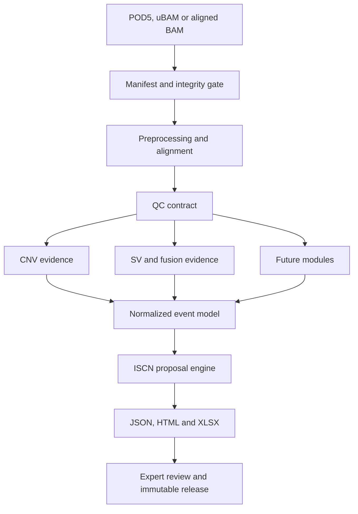

# Architecture

## Design principles

1. **One sample, one immutable run envelope.** Every run has a validated manifest,
   isolated working directory, result contract, logs, tool versions and checksums.
2. **Evidence before interpretation.** Callers emit normalized evidence. ISCN and clinical
   interpretation are downstream, reviewable views rather than hidden caller side effects.
3. **Assay modes stay separate.** Low-coverage WGS and adaptive sampling use different
   coverage assumptions, QC and reportability policies.
4. **Fail visibly.** A missing module is `NOT_RUN`; it is never represented as a negative
   biological result.
5. **No automatic clinical release.** Software can assemble a proposal, but an authorized
   reviewer owns interpretation and signature.
6. **Evidence-gated algorithms.** A tool is a candidate until it passes the locked benchmark
   for its assay, coverage, tumor/blast fraction and reportable event classes.

## Logical flow



## Planned run envelope

```text
results/<run_id>/<sample_id>/
├── manifest/
│   ├── sample.manifest.json
│   ├── input.checksums.sha256
│   └── reference.lock.json
├── qc/
│   ├── qc.contract.json
│   └── metrics/
├── evidence/
│   ├── cnv/
│   ├── sv/
│   └── fusion/
├── normalized/
│   └── result.json
├── reports/
│   ├── report.html
│   └── results.xlsx
├── provenance/
│   ├── tools.json
│   ├── parameters.json
│   └── workflow.dag.svg
└── release/
    ├── review.json
    ├── checksums.sha256
    └── signed-release.json
```

## Adapter boundary

Each bioinformatics tool will have an adapter with four responsibilities:

1. validate required input and reference compatibility;
2. build an auditable command without shell interpolation of untrusted values;
3. capture versions, parameters, exit status and raw output paths;
4. normalize output into the versioned event contract.

Adapters never decide clinical reportability on their own. Reportability policy belongs to
the versioned assay profile and its validation evidence.

The SV lane implements this boundary independently for Sniffles2 and cuteSV: shell-free
argument-vector execution, explicit version and policy locks, VCF output without read names,
defensive normalization and non-reportable candidates. A separate consensus adapter canonicalizes
breakend order and clusters compatible caller records; it never treats either caller or their
agreement as truth.

Build- and checksum-locked interval adapters then attach Gene A/B, cytobands and artifact context.
The existing target-coverage contract supplies breakpoint observability for Adaptive Sampling. A
small local AML pattern resource can change review priority but cannot assert a fusion, analytical
validation, reportability or ISCN semantics. The final deterministic prioritizer reads all weights
and cut-offs from `configs/sv/evidence-priority.technical.yaml`. See
`docs/SV_EVIDENCE_LAYER.md` for the resource and validation contract.

## Evidence lifecycle

Each scientific dependency progresses through `candidate -> benchmarked -> validated ->
retired`. Promotion requires a versioned evidence record, locked test data, predefined metrics
and validation-impact review. Literature supports candidate selection; it cannot replace local
analytical validation. See `docs/EVIDENCE_BASE.md`.

## ISCN boundary

The `subset-v0.1-unvalidated` renderer exists to exercise traceability and reporting. It is
not a substitute for the authorized ISCN 2024 standard. Full implementation requires:

- build-aware coordinate-to-cytoband reference locks;
- syntactic parser and renderer round trips;
- authorized positive, negative and edge-case test cases;
- clone/mosaicism and uncertainty semantics;
- expert cytogenetic review and controlled change management.

## Portable HTML boundary

The HTML renderer still consumes the versioned `PipelineResult` directly; it is not a separate
clinical or persistence contract. Dynamic values are HTML-escaped. Warning text and module reasons
redact complete URIs, absolute paths, recognized file-suffixed relative path tokens and exact
path-key assignments. A slash alone is not treated as a path, so terms such as `CNV/SV` remain
intact. Recognized tools have separate exact parameter allowlists for path-free booleans, integers,
finite floats, short strings and flat lists; unknown tools, keys or path-like values are omitted and
marked as redacted. Raw input paths, resolved-resource roots/paths and sidecar relative paths are
not rendered. The report uses only inline CSS and JavaScript and therefore needs no CDN or remote
runtime resource. These syntactic filters are defense in depth for the portable HTML, not general
de-identification of the JSON result or of identifiers that do not look like paths.
